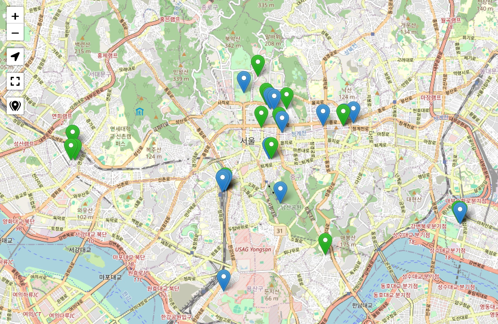

# Leaflet.Control.Zoom2Markers

A basic [Leaflet](https://leafletjs.com) control that, when clicked, zooms the map to show all markers.

In lieu of a demo (because this plugin is so dead simple), here's a screenshot – it's the bottom-most button.



## Setup

Download or clone this repository, then reference the JavaScript code and stylesheet in your HTML:

```html
<link rel="stylesheet" href="Control.Zoom2Markers.css">
<script src="Control.Zoom2Markers.js"></script>
```


## Usage

After initializing your map:

```js
L.control.zoom2markers({
    position: 'topleft',
    title: 'Zoom to Markers',
    forceSeparateButton: false,  // separate from +/- zoom controls?
}).addTo(map);
```

(These are the default options, you can omit them unless you're going to assign different values.)

You can exclude markers from consideration by setting `zoom2MarkersExclude: true` in *their* options; the zoom action will then ignore them.


## Notes

Not tested for "interactions" (as in, drug interactions) with other extensions. (This one just scoops up all layers of type `L.Marker` into a `FeatureGroup`, then `fitBounds` the map to that group's `getBounds()`.)


## Acknowledgements

The icon is MIT Licensed and © [Etn Ccis](https://github.com/etn-ccis/blui-icons?ref=svgrepo.com).

The code is based on [Bruno Bergot's "leaflet.fullscreen" extension](https://github.com/brunob/leaflet.fullscreen).
